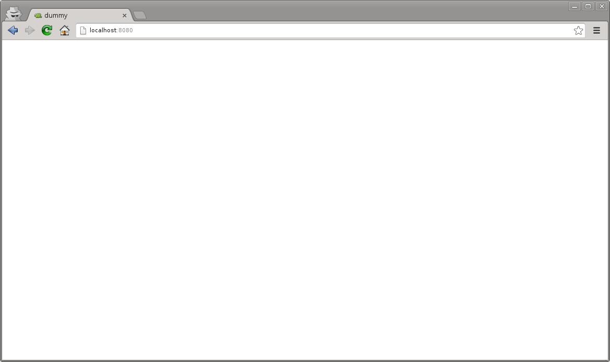
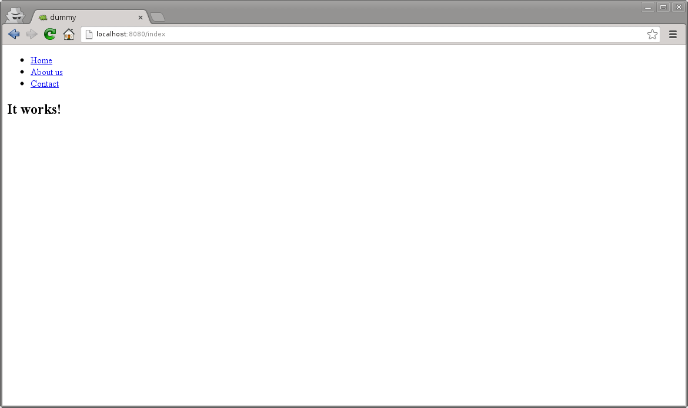
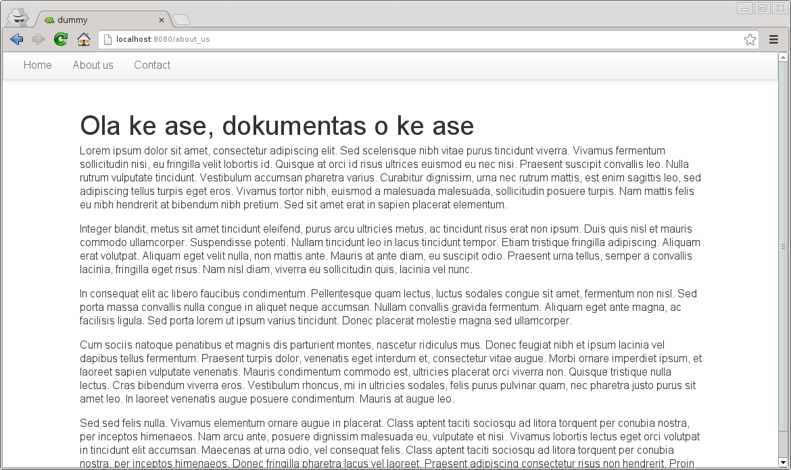
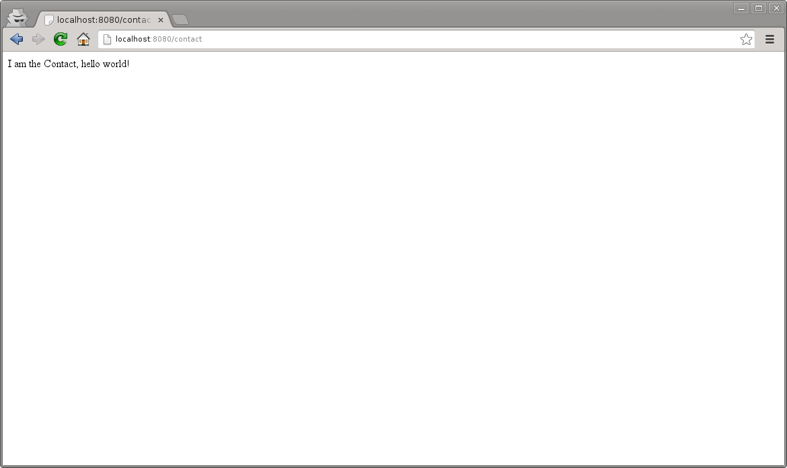
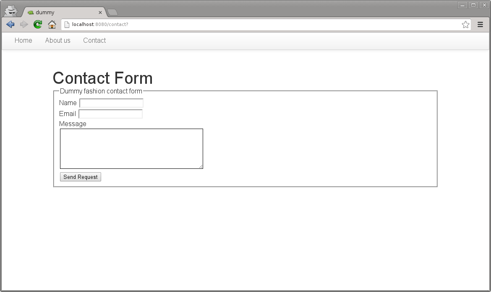

.. _getting_started:

Getting Started
===============

Ready to get started? This is a section for the impatient, and give you a very basic introduction about Mamba. If you are looking for detailed information about how to contribute with Mamba go to :ref:`contributing` page. If you're looking for `Twisted <http://twistedmatrix.com/trac/wiki/Documentation>`_  documentation, just click on the link to go their documentation section.

In this section we are going to create a first dummy Mamba application to get familiar with the `mamba-admin` command line tool and the mamba's MVC model.

|

Generate the application
------------------------

First of all, we are going to generate our mamba application using the `mamba-admin` command line tool::

    $ mamba-admin application --description='Dummy Application' --app-version=1.0 --logfile='service.log' --port=8080 -n dummy
    Creating dummy directory...                                              [Ok]
    Generating application/ directory...                                     [Ok]
    Generating application/controller directory...                           [Ok]
    Generating application/model directory...                                [Ok]
    Generating application/view directory...                                 [Ok]
    Generating application/view/templates directory...                       [Ok]
    Generating application/view/stylesheets directory...                     [Ok]
    Generating twisted directory...                                          [Ok]
    Generating twisted/plugins directory...                                  [Ok]
    Generating static directory...                                           [Ok]
    Generating config directory...                                           [Ok]
    Writing Twisted plugin...                                                [Ok]
    Writing plugin factory...                                                [Ok]
    Writing mamba service...                                                 [Ok]
    Writing configuration file...                                            [Ok]
    Writing favicon.ico file...                                              [Ok]
    Writting layout.html template file...                                    [Ok]

This command generates a new Mamba application directory called **dummy** which contains all the necessary files to start working in our new application. The auto-generated application is already startable so we can just run our application using the **start** Mamba admin subcommand inside the recently generated directory::

    $ cd dummy
    $ mamba-admin start
    starting application dummy...                                            [Ok]

|

This will start the Twisted web server in the port 8080. If we redirect our browser to this port we should get a blank page like in the image below.

|

Adding some HTML content
------------------------

Now, we are going to add some HTML static content to our new Mamba web application, to do that we have to edit the main Jinja2 template layout.html file in the ``view/templates`` directory.

.. note:: To get detailed information about Mamba's MVC pattern and directory hierarchy refer to :doc:`development/MVC_and_hierarchy`.

When we first open the file we should get a common Jinja2 template file that looks like this:

.. code-block:: jinja

    
    
        <!-- Put your head content here, without <head></head> tags -->
    {{ super() }}
    
    
        <!-- Put your body content here, without <body></body> tags -->
    
    
        <!-- Put your loadable scripts here -->
    {{ super() }}
    

|

The default layout extends ``root_page.html`` layout that is used internally by Mamba to add scripts and other components in an automatic way into your applications.

.. warning:: If you want Mamba to include for you all the *mambaerized* CSS and JavaScript files that you added to the ``view/scripts`` and ``view/stylesheets`` directory automatically, your layout **must** extend from ``root_page.html`` template or Mamba will not add any script or CSS file that is present in the directories mentioned above. If you try to use the Jinja2 templating **super()** method in a block that should have been inherited from *root_page.html* you are going to get back an unhandled exception from the Jinja2 templating system.

We are going to add the common HTML elements that all our pages will share in the layout.html template that Mamba generated for us in the previous step. We are going to create an ``index.html`` template file just for our index page, in this way we can just inherit from our ``layout.html`` file from whatever other template we add to the site. Add this code to the body block in the ``layout.html`` file:

.. code-block:: jinja

    
    
        <!-- Put your head content here, without <head></head> tags -->
    {{ super() }}
    
    
        <!-- Put your body content here, without <body></body> tags -->

        
        

            <ul class="nav">
                <li><a href="/index">Home</a></li>
                <li><a href="/about_us">About us</a></li>
                <li><a href="/contact">Contact</a></li>
            </ul>
        

        

        
        

    
    
        <!-- Put your loadable scripts here -->
    {{ super() }}
    

|

Now we are going to generate our *index* template file using the *mamba-admin* command line tool::

    $ mamba-admin view --description='Index template for Dummy application' index

|

This will generate a new Jinja2 template file called ``index.html`` in the ``view/templates`` directory with the following content:

.. code-block:: jinja

    
    
    {{ super() }}

    <!--
        Copyright (c) 2013 - damnwidget <damnwidget@localhost>

        view: Index
            synopsis: Index template for Dummy application

        viewauthor: damnwidget <damnwidget@localhost>
    -->

    <h2>It works!</h2>

    

.. note::

    In your case the copyright and view author information will reflect your environment user configuration, this is pretty OS dependant

If we refresh our browser window we should get the following unstyled HTML on it:

|

Congratulations, you rendered your first Mamba template sucessfully!. Now we are going to make some changes to the index template and add a CSS file to style a bit our index page:

.. code-block:: jinja

    
        
        {{ super() }}

        <!--
            Copyright (c) 2013 - damnwidget <damnwidget@localhost>

            view: Index
                synopsis: Index template for Dummy application

            viewauthor: damnwidget <damnwidget@localhost>
        -->

        

            <h2>Welcome to the Dummy Site!</h2>
            
Snakes are so cute aren't it?.

            
        

        

.. code-block:: css

    /*
     *  -*- mamba-file-type: mamba-css -*-
     */

    body {
        background-color: #fff;
        color: #333;
        display: block;
        font-family: "Helvetica Neue", Helvetica,Arial,sans-serif;
        font-size: 16px;
        line-height: 20px;
        margin: 0;
        padding-top: 40px;
        position: relative;
    }

    a {
        color: #717171;
    }

    .navigation {
        content: "";
        background-color: #fafafa;
        background-image: linear-gradient(to bottom, #fff, #f2f2f2);
        background-repeat: repeat x;
        border: 1px solid #d4d4d4;
        box-shadow: 0 1px 10px rgba(0,0,0,0.1);
        line-height: 0;
        left: 0;
        margin-bottom: 0;
        min-height: 40px;
        position: fixed;
        right: 0;
        top: 0;
    }

    .nav {
        display: block;
        float: left;
        left: 0;
        list-style: none;
        margin: 0 10px 0 0;
        padding: 0;
        position: relative;
    }

    .nav li {
        display: list-item;
        float: left;
        line-height: 20px;
        margin-left: 30px;
        margin-top: 8px;
    }

    .nav li a {
        text-decoration: none;
    }

    .nav li a:hover {
        color: #aab212;
    }

    .content {
        margin: 20px auto;
        width: 920px;
    }

    .content h2 {
        font-size: 40px;
        margin: 60px 0 10px;
        font-weight: 200;
    }

.. note::

    Mamba CSS files should add the ``-*- mamba-file-type: mamba-css -*-`` special comment to be automatically loaded by mamba on startup

This will give us the result that you can see in the following screenshot:

.. image:: _static/getting_started/getting_started_03.png

|

Our web site is starting to look like a real one, but if we click in the *About Us* or *Contact* links we will get blank page with an error message saying **No Such Resource**. This is because we didn't add any template or controller to *about_us* or *contact* routes.

Mamba allow us to use views directly without the need of a controller. This way, we can add just static sections into our web site without any controller overhead. We are going to add a new static template for the about us section::

    $ mamba-admin view --description='About us static template for Dummy application' about_us

This will create a new file in the ``application/view/templates`` directory called *about_us.html*. If we click again in the *About Us* link we should get the **It works!** default template message.

At this point maybe you are thinking that the templates directory is kinda ``htdocs`` directory in a traditional web server like *Apache* but that's not true. Mamba will render any HTML file or Jinja2 template that exists in your *templates* directory but will be unable to find any other media, stylesheet or JavaScript file that is stored in this directory. All the static data that we want to access within our templates must be placed in the *static* directory in the *root* of your application or in *mambaerized* files (files with the right mamba header string) within ``view/stylesheets`` and ``view/scripts`` directories.

This is because the HTML rendering is performed internally by the Mamba templating system. It doesn't know anything about files that are not HTML, Jinja2 templates or mamberized cascading stylesheets and JavaScript files. This way, we can mix static HTML data and controllers in the same application sharing the same static resources between them.

.. warning::

    Be aware of dragons: Mamba take care of automatically adding CSS and Javascript files that are *mambaerized* in the ``view/stylesheets`` and ``view/scripts`` directories into your templates but **will not** do it for the files you place in the static directory

Now, we just add a `lorem ipsum <http://en.wikipedia.org/wiki/Lorem_ipsum>`_ text to our About Us section to get something like this:

|

Adding our first controller
---------------------------

Now we are ready to add our first controller. To do that - yes, you guessed it - we are going to use the *mamba-admin* command line tool. We gotta know a couple of things about controllers before diving into adding one:

    * Registering Routes
        Mamba controllers can be attached to static routes using the ``--route`` parameter (or editing the __route__ property in the controller object) so all the entry points that this controller adds should share the same parent route. For example: if the register route is ``api`` and we have two methods ``login`` and ``logout`` the full URL route will be::

            http://localhost/api/login
            http://localhost/api/logout

    * Controllers are Twisted Resources
        Controllers in Mamba are just special Twisted resources that are *mambaerized* for being loaded (and reloaded on changes if you are running the Mamba server on Linux) automatically on server startup as well as other custom Mamba features. One of those custom features is the Mamba's routing system. In Mamba we don't add childs to Twisted resources that have been already added as childs to the ``Site`` object. In Mamba we use routes as we do in Flask or Bottle:

        .. sourcecode:: python

            ....
            @route('/status', method='GET')
            def status(self, request, **kwargs):
                """Just return a string indicating the status of dummy
                """
                return dummy.get_status()

        Mamba is meant to be flexible enough to allow the programmer to use whatever they can already use with ``twisted.web`` component so the user is allowed to add ``twisted.web.resource.Resource`` objects as childs on controllers that has configured their ``isLeaf`` property to ``False``, but we recommend using ``twisted.web`` directly and use Mamba as external library if you need some Mamba functionallity that is not directly related with rendering the web site.

|

Our first (and unique) controller is going to be the ``contact`` one. To generate it, we can use the ``mamba-admin`` command line tool::

    $ mamba-admin controller --description='Contact form for Dummy' --route='contact' contact

|

This will create a new file called ``contact.py`` in the ``application/controller`` directory, that should look like this:

.. sourcecode:: python

    # -*- encoding: utf-8 -*-
    # -*- mamba-file-type: mamba-controller -*-
    # Copyright (c) 2013 - damnwidget <damnwidget@localhost>

    """
    .. controller:: Contact
        :platform: Linux
        :synopsis: Contact form for Dummy

    .. controllerauthor:: damnwidget <damnwidget@localhost>
    """

    from mamba.web.response import Ok
    from mamba.application import route
    from mamba.application import controller

    class Contact(controller.Controller):
        """
        Contact form for Dummy
        """

        name = 'Contact'
        __route__ = 'contact'

        def __init__(self):
            """
            Put your initialization code here
            """
            super(Contact, self).__init__()

        @route('/')
        def root(self, request, **kwargs):
            return Ok('I am the Contact, hello world!')

|

At this point - if we are on GNU/Linux - the controller has been automatically loaded by the already-running Mamba server and we can show the resulting page clicking in the *Contact* link in our fashion web site, otherwise we have to stop the server and start it again to see the changes::

    $ mamba-admin stop && mamba-admin start

|

.. note::

    You can also use ``mamba-admin restart``.

That's cool but we have to add some HTML to this so we are going to add a new view for this controller using - wait for it - the ``mamba-admin`` command line interface::

    $ mamba-admin view --description='Contact view for contact controller on Dummy' root contact

|

As you can see, we've added a new parameter to our ``view`` subcommand that tells Mamba that this view is using the ``contact`` controller. In this occasion the ``mamba-admin`` command has created a new directory called ``contact`` in ``application/view`` and inside this one a new file called ``root.html`` has been generated (as the root method for ``/``) route in the controller.

.. note::

    If we have a static template called ``contact.html`` in the ``templates`` directory, it will be overwritten by the new controller template.

.. note::

    Controller views are per route so you need a view for every route that need to render HTML directly to the browser.

|

Now we have to modify our controller a bit in order to make it use the new template file. First, we are going to import the ``templating`` module from the ``mamba.core`` package, then we must create a new :class:`~mamba.core.templating.Template` object and pass the controller to it, we are going to do that in the controller constructor and render the template later as the response from the ``root`` method:

.. sourcecode:: python

    # -*- encoding: utf-8 -*-
    # -*- mamba-file-type: mamba-controller -*-
    # Copyright (c) 2013 - damnwidget <damnwidget@localhost>

    """
    .. controller:: Contact
        :platform: Linux
        :synopsis: Contact form for Dummy

    .. controllerauthor:: damnwidget <damnwidget@localhost>
    """

    from mamba.core import templating
    from mamba.web.response import Ok
    from mamba.application import route
    from mamba.application import controller

    class Contact(controller.Controller):
        """
        Contact form for Dummy
        """

        name = 'Contact'
        loaded = False
        __route__ = 'contact'

        def __init__(self):
            """
            Put your initialization code here
            """
            super(Contact, self).__init__()

            self.template = templating.Template(controller=self)

        @route('/', method='GET')
        def root(self, request, **kwargs):
            return Ok(self.template.render().encode('utf-8'))

|

Let's add some HTML to build our dummy form:

.. sourcecode:: jinja

    
        
        {{ super() }}

        <!--
            Copyright (c) 2013 - damnwidget <damnwidget@localhost>

            view: ContactForm
                synopsis: Contact view for contact controller on Dummy

            viewauthor: damnwidget <damnwidget@localhost>
        -->

        

            <h2>Contact Form</h2>
            <form>
                <fieldset>
                    <legend>Dummy fashion contact form</legend>
                    <label>Name</label>
                    <input id="name" type="text" required> 
                    <label>Email</label>
                    <input id="email" type="email" required> 
                    <label>Message</label> 
                    <textarea id="content" rows="6" cols="40">
                    </textarea> 
                    <button type="submit">Send Request</button>
                </fieldset>
            </form>
        

        

|

If we restart (if not on GNU/Linux) the server and go to our ``contact`` page we should get this fancy form:

The End
-------

And we have reached the end of this basic introduction to Mamba framework, there is a lot more to discover about Mamba's features but we hope you have now an idea of the backbone of the framework.

Of course all the files that we created with the ``mamba-admin`` command line tool can be created by hand and it should work as expected. If you want to see a real world Mamba application, we suggest you to visit the `BlackMamba <https://github.com/PyMamba/BlackMamba>`_ GitHub repository.

|
